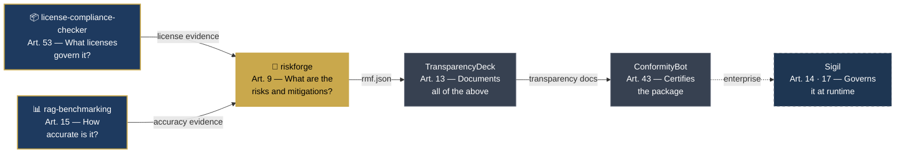

<!-- AiExponent LLC — Organization Profile -->
<div align="center">
  <h1>AiExponent</h1>
  <p><strong>Building AI that deserves to be trusted.</strong></p>
  <p>
    <a href="https://aiexponent.com"></a>
    <a href="https://pypi.org/user/aiexponenthq/"></a>
    
    
  </p>
</div>

---

## The Problem

The EU AI Act is not coming. **It is here.**

| Deadline | Status | Consequence |
|---|---|---|
| February 2025 | ✅ Enforced | 8 AI practices are **illegal**. Fines up to €35M. |
| August 2025 | ✅ Enforced | GPAI providers must publish documentation. AI literacy required. |
| **August 2026** | ⚠️ **4 months away** | All high-risk AI systems need risk management, accuracy evidence, transparency docs. Fines up to **€30M or 6% of global turnover**. |

Most engineering teams cannot produce the required documentation. AiExponent builds the tools that change that — in 30 minutes, not 30 weeks.

---

## Open Source Tools

Three production-ready tools. Each maps to an active enforcement obligation. Each produces a concrete artefact your legal team can file.

### [license-compliance-checker](https://github.com/aiexponenthq/license-compliance-checker) · Article 53

> *"Which licenses govern every component in my AI stack — including the models?"*

```bash
pip install license-compliance-checker
lcc scan . --policy eu-ai-act-compliance --format json
```

The only open-source scanner that combines dependency license detection, AI model license analysis (HuggingFace Hub API, GGUF, ONNX), and EU AI Act Article 53 compliance — in a single command.

**Output:** Article 53 compliance pack — `eu_ai_act_report.json` + CycloneDX SBOM + training data risk summary.

[](https://pypi.org/project/license-compliance-checker/)
[](https://github.com/aiexponenthq/license-compliance-checker/actions)

---

### [rag-benchmarking](https://github.com/aiexponenthq/rag-benchmarking) · Article 15

> *"Can I prove my RAG system is accurate enough to deploy? Can I show regulators the evidence?"*

```bash
pip install rag-benchmarking
# Plug in your LangChain, LlamaIndex, or custom pipeline
```

Framework-agnostic evaluation harness for RAG and agentic AI systems. 12 metrics across classic RAG, retrieval quality, and agentic-era evaluation. Measured faithfulness of **0.958** on the 50-sample golden dataset.

**Output:** `BenchmarkReport` JSON — audit-ready accuracy evidence for Article 15 compliance.

[](https://pypi.org/project/rag-benchmarking/)
[](https://github.com/aiexponenthq/rag-benchmarking/actions)

---

### [riskforge](https://github.com/aiexponenthq/riskforge) · Article 9

> *"Where is my Article 9 risk management file? How do I produce one before August 2026?"*

```bash
pip install riskforge
riskforge init --name "My AI System" --sys-version "1.0" \
  --purpose "..." --provider "MyOrg" --category essential_services
riskforge assess <system-id> --assessor-name "..." --assessor-role "..."
riskforge export <system-id> --format pdf
```

Guided 8-dimension risk assessment CLI with 50+ questions, Annex III pattern matching, SHA-256 hash-chained audit trail. Article 9 documentation in ~30 minutes.

**Output:** Signed PDF + `rmf.json` — Article 9 / Annex IV Risk Management File for regulator submission.

[](https://pypi.org/project/riskforge/)
[](https://github.com/aiexponenthq/riskforge/actions)

---

## The Compound Moat

Each tool produces structured evidence consumed by the next. Together they cover the complete technical documentation chain required for high-risk AI system compliance.



**Solid gold border** = open source, available now. **Dashed** = enterprise roadmap.

---

## Global Regulatory Coverage

Designed for the EU AI Act. Cross-mapped to every active framework:

| Framework | Status | Covered by |
|---|---|---|
| EU AI Act Art. 5 (prohibited practices) | ✅ Enforced Feb 2025 | RiskForge |
| EU AI Act Art. 53 (GPAI transparency) | ✅ Enforced Aug 2025 | license-compliance-checker |
| EU AI Act Art. 9–15 (high-risk systems) | ⚠️ August 2026 | All three tools |
| NIST AI RMF 1.0 | Active — US federal mandatory | RiskForge (cross-map built-in) |
| ISO/IEC 42001:2023 | Active — procurement gate | RiskForge (Annex A controls) |
| Colorado AI Act SB 24-205 | Active since Feb 2026 | RiskForge |
| Texas HB 1709 | Active since Sep 2025 | RiskForge |

---

## Enterprise: Sigil

Commercial AI agent governance platform. Real-time policy enforcement, audit logging, and compliance reporting for AI agents in production.

→ [aiexponent.com/products#sigil](https://aiexponent.com/products#sigil)

---

## Contributing

All tools are **Apache 2.0 licensed**. Contributions welcome.

The easiest contribution requires **zero Python** — add a risk question, a license pattern, or a benchmark metric by editing a YAML file. See `CONTRIBUTING.md` in each repository.

---

<div align="center">
  <sub>
    <a href="https://aiexponent.com">aiexponent.com</a> ·
    <a href="mailto:hello@aiexponent.com">hello@aiexponent.com</a> ·
    Built in the open · Apache 2.0
  </sub>
</div>
